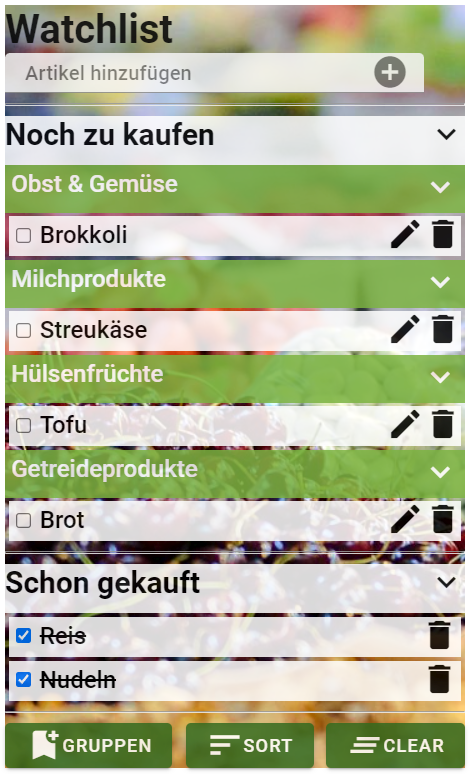

# Shopping list with React.js
This repository contains a shopping list which serves as a final project of the course "Fundamentals of Programming". It was developed with HTML5, CSS3 and React.js.  

The live version is on GitHub Pages:  
https://artingo.github.io/Einkaufsliste/

The final result looks like this: 

Freddie Walther
