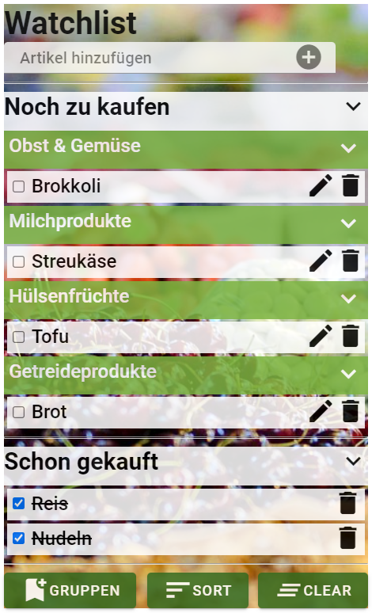

# Einkaufsliste mit React.js
Dieses Repository enthält eine Einkaufsliste, welche als Abschlussprojekt des Kurses "Grundlagen der Programierung" dient
und mit HTML5, CSS3 und React.js entwickelt wurde.  

Die Live-Version ist auf GitHub Pages:  
https://artingo.github.io/Einkaufsliste/

Das Endergebnis sieht so aus:  

Coach @lfr€d
